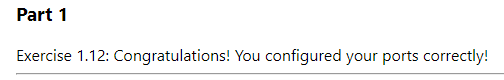

# DevOps with Docker
## Part 1 | Exercise 1.12

A good developer creates well-written READMEs. Such that they can be used to create Dockerfiles with ease.  
Clone, fork or download the project from https://github.com/docker-hy/material-applications/tree/main/example-frontend.

Create a Dockerfile for the project (example-frontend) and give a command so that the project runs in a Docker container with port 5000 exposed and published so when you start the container and navigate to http://localhost:5000 you will see message if you're successful.

Submit the Dockerfile.  
_As in other exercises, do not alter the code of the project_

```shell
[root@arch-01 example-frontend]# vim Dockerfile
[root@arch-01 example-frontend]# docker build . -t frontend
Sending build context to Docker daemon  729.1kB
Step 1/9 : FROM node:16-alpine
16-alpine: Pulling from library/node
7264a8db6415: Pull complete 
eee371b9ce3f: Pull complete 
93b3025fe103: Pull complete 
d9059661ce70: Pull complete 
Digest: sha256:a1f9d027912b58a7c75be7716c97cfbc6d3099f3a97ed84aa490be9dee20e787
Status: Downloaded newer image for node:16-alpine
 ---> 2573171e0124
Step 2/9 : WORKDIR /usr/src/app
 ---> Running in 25dd53ef836d
Removing intermediate container 25dd53ef836d
 ---> a96cafe18f46
Step 3/9 : COPY ./ ./
 ---> 7da8b2bae970
Step 4/9 : RUN npm install --silent
 ---> Running in ce90509f4342
Removing intermediate container ce90509f4342
 ---> fb17412e26fc
Step 5/9 : RUN npm run build --quiet
 ---> Running in d9daac3f5c1c

> example-frontend@0.1.0 build
> react-scripts build

Creating an optimized production build...
Compiled successfully.

File sizes after gzip:

  77.24 KB  build/static/js/2.43ca3586.chunk.js
  1.9 KB    build/static/js/main.1be634bd.chunk.js
  781 B     build/static/js/runtime-main.223e45fb.js
  235 B     build/static/css/main.eaa5d75e.chunk.css

The project was built assuming it is hosted at /.
You can control this with the homepage field in your package.json.

The build folder is ready to be deployed.
You may serve it with a static server:

  npm install -g serve
  serve -s build

Find out more about deployment here:

  https://cra.link/deployment

Removing intermediate container d9daac3f5c1c
 ---> 764c6b37404a
Step 6/9 : RUN npm install -g serve --silent
 ---> Running in c0a5df55ba93
Removing intermediate container c0a5df55ba93
 ---> 5e4f8372bf82
Step 7/9 : ENV port=5000
 ---> Running in 0919b3cc9cd3
Removing intermediate container 0919b3cc9cd3
 ---> 788ef9bf8e28
Step 8/9 : EXPOSE $port
 ---> Running in 347132cfd9a8
Removing intermediate container 347132cfd9a8
 ---> 3b0fb3f61ca0
Step 9/9 : CMD serve -s -l $port build
 ---> Running in 74d962c4414d
Removing intermediate container 74d962c4414d
 ---> 391187e9449b
Successfully built 391187e9449b
Successfully tagged frontend:latest
[root@arch-01 example-frontend]# docker run -dp 5000:5000 frontend
c9787ac80fdd12d99691a1a90245dde4d4b547f68818d42428977a8582fd1d59
```


