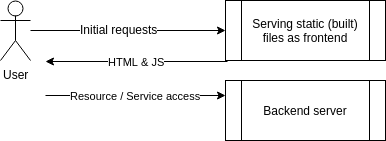

# DevOps with Docker
## Part 1 | Exercise 1.14

Start both the frontend and the backend with the correct ports exposed and add [ENV](https://docs.docker.com/reference/dockerfile/#env) to Dockerfile with the necessary information from both READMEs ([front](https://github.com/docker-hy/material-applications/tree/main/example-frontend), [back](https://github.com/docker-hy/material-applications/tree/main/example-backend)).

Ignore the backend configurations until the frontend sends requests to `_backend_url_/ping` when you press the button.
You know that the configuration is ready when the button for 1.14 of frontend responds and turns green.

_Do not alter the code of either project_

Submit the edited Dockerfiles and commands used to run.



The frontend will first talk to your browser. Then the code will be executed from your browser and that will send a message to the backend.


> [!TIP]
> When configuring web applications keep the browser developer console ALWAYS open, F12 or cmd+shift+I when the browser window is open. Information about configuring cross-origin requests is in the README of the backend project.

---

Dockerfile: [backend](backend/Dockerfile)  
Dockerfile: [frontend](frontend/Dockerfile)

```shell
[root@arch-01 material-applications]# vim example-frontend/Dockerfile
[root@arch-01 material-applications]# vim example-backend/Dockerfile
[root@arch-01 material-applications]# docker build example-frontend/ -t frontend -f example-frontend/Dockerfile
Sending build context to Docker daemon  729.1kB
Step 1/10 : FROM node:16-alpine
 ---> 2573171e0124
Step 2/10 : WORKDIR /usr/src/app
 ---> Using cache
 ---> 298d3b647a18
Step 3/10 : COPY ./ ./
 ---> Using cache
 ---> 5440378a30dc
Step 4/10 : RUN npm install --silent
 ---> Using cache
 ---> 1a4bc7cafc8d
Step 5/10 : ARG REACT_APP_BACKEND_URL=http://localhost:8080
 ---> Using cache
 ---> 80e2ae712bf6
Step 6/10 : RUN npm run build --silent
 ---> Using cache
 ---> c88e692ca308
Step 7/10 : RUN npm install -g serve --silent
 ---> Using cache
 ---> b76bfaf216b2
Step 8/10 : ENV PORT=5000
 ---> Using cache
 ---> da2ba5dcde8b
Step 9/10 : EXPOSE $PORT
 ---> Using cache
 ---> 4d5dcd9c502b
Step 10/10 : CMD serve -s -l $PORT build
 ---> Using cache
 ---> fbb142a52eda
Successfully built fbb142a52eda
Successfully tagged frontend:latest
[root@arch-01 material-applications]# docker build example-backend/ -t backend -f example-backend/Dockerfile
Sending build context to Docker daemon   42.5kB
Step 1/9 : FROM golang:1.16
 ---> 972d8c0bc0fc
Step 2/9 : WORKDIR /usr/src/app
 ---> Using cache
 ---> 6ffab933894e
Step 3/9 : COPY ./ ./
 ---> Using cache
 ---> 226e4429f6d1
Step 4/9 : ENV REQUEST_ORIGIN=*
 ---> Using cache
 ---> 98d4b6900df8
Step 5/9 : RUN go build
 ---> Using cache
 ---> bdb6067e6a42
Step 6/9 : RUN go test ./...
 ---> Using cache
 ---> 4b1a5568f6ab
Step 7/9 : ENV PORT=8080
 ---> Using cache
 ---> 929096210c93
Step 8/9 : EXPOSE $PORT
 ---> Using cache
 ---> 18109a0eaaf4
Step 9/9 : CMD ./server
 ---> Using cache
 ---> 029ec72a38f3
Successfully built 029ec72a38f3
Successfully tagged backend:latest
[root@arch-01 material-applications]# docker run -dp 8080:8080 backend
da2c12228e5aff01e1f4315d6f8b9b14cb348372958c3a6aca1ff3b3ae1b8cd3
[root@arch-01 material-applications]# docker run -dp 5000:5000 frontend
53f6d5d3b7ef812cad8f7c4971d7a99be50bc189366ae9bf489745b97b955f36
```


