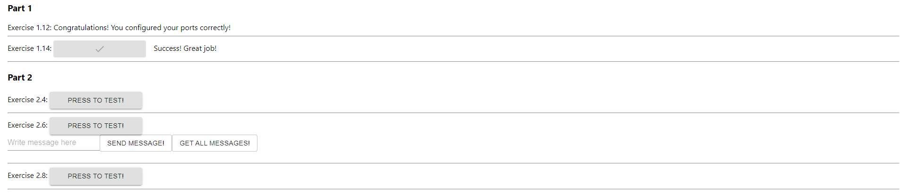

# DevOps with Docker
## Part 2 | Exercise 2.3

As we saw previously, starting an application with two programs was not trivial and the commands got a bit long.

In the [previous part](https://devopswithdocker.com/part-1/section-6) we created Dockerfiles for both [frontend](https://github.com/docker-hy/material-applications/tree/main/example-frontend) and [backend](https://github.com/docker-hy/material-applications/tree/main/example-backend) of the example application. Next, simplify the usage into one docker-compose.yml.  
Configure the backend and frontend from [part 1](https://devopswithdocker.com/part-1/section-6#exercises-111-114) to work in Docker Compose.

Submit the docker-compose.yml

---

The Dockerfiles are attached to this exercise's subdirectory and were used as build context from their project folders, respectively.

```shell
[root@arch-01 ~]# docker compose build
[+] Building 1.3s (21/21) FINISHED                                                                                                                                          docker:default
 => [backend internal] load build definition from Dockerfile                                                                                                                          0.0s
 => => transferring dockerfile: 313B                                                                                                                                                  0.0s
 => [backend internal] load .dockerignore                                                                                                                                             0.0s
 => => transferring context: 111B                                                                                                                                                     0.0s
 => [backend internal] load metadata for docker.io/library/golang:1.16                                                                                                                0.5s
 => [backend 1/5] FROM docker.io/library/golang:1.16@sha256:5f6a4662de3efc6d6bb812d02e9de3d8698eea16b8eb7281f03e6f3e8383018e                                                          0.0s
 => [backend internal] load build context                                                                                                                                             0.0s
 => => transferring context: 28.90kB                                                                                                                                                  0.0s
 => CACHED [backend 2/5] WORKDIR /usr/src/app                                                                                                                                         0.0s
 => CACHED [backend 3/5] COPY ./ ./                                                                                                                                                   0.0s
 => CACHED [backend 4/5] RUN go build                                                                                                                                                 0.0s
 => CACHED [backend 5/5] RUN go test ./...                                                                                                                                            0.0s
 => [backend] exporting to image                                                                                                                                                      0.0s
 => => exporting layers                                                                                                                                                               0.0s
 => => writing image sha256:7bd53513dbe14eaa3dc67ece3b2303584cba09e7c0aec10e6f6a7ed6ea45f696                                                                                          0.0s
 => => naming to docker.io/library/backend                                                                                                                                            0.0s
 => [frontend internal] load build definition from Dockerfile                                                                                                                         0.0s
 => => transferring dockerfile: 521B                                                                                                                                                  0.0s
 => [frontend internal] load .dockerignore                                                                                                                                            0.0s
 => => transferring context: 87B                                                                                                                                                      0.0s
 => [frontend internal] load metadata for docker.io/library/node:16-alpine                                                                                                            0.4s
 => [frontend 1/6] FROM docker.io/library/node:16-alpine@sha256:a1f9d027912b58a7c75be7716c97cfbc6d3099f3a97ed84aa490be9dee20e787                                                      0.0s
 => [frontend internal] load build context                                                                                                                                            0.0s
 => => transferring context: 708.45kB                                                                                                                                                 0.0s
 => CACHED [frontend 2/6] WORKDIR /usr/src/app                                                                                                                                        0.0s
 => CACHED [frontend 3/6] COPY ./ ./                                                                                                                                                  0.0s
 => CACHED [frontend 4/6] RUN npm install --silent                                                                                                                                    0.0s
 => CACHED [frontend 5/6] RUN npm run build --silent                                                                                                                                  0.0s
 => CACHED [frontend 6/6] RUN npm install -g serve --silent                                                                                                                           0.0s
 => [frontend] exporting to image                                                                                                                                                     0.0s
 => => exporting layers                                                                                                                                                               0.0s
 => => writing image sha256:716009b3db661d03718d4dd2df1094fdaf848811b5cd8eb0dcb8b8ccfe35d4cf                                                                                          0.0s
 => => naming to docker.io/library/frontend                                                                                                                                           0.0s
[root@arch-01 ~]# docker compose up -d
[+] Running 3/3
 ✔ Network root_default  Created                                                                                                                                                      0.1s 
 ✔ Container backend     Started                                                                                                                                                      0.5s 
 ✔ Container frontend    Started                                                                                                                                                      0.8s 
[root@arch-01 ~]# docker compose ps
NAME       IMAGE      COMMAND                  SERVICE    CREATED              STATUS              PORTS
backend    backend    "/bin/sh -c ./server"    backend    About a minute ago   Up About a minute   0.0.0.0:8080->8080/tcp, :::8080->8080/tcp
frontend   frontend   "docker-entrypoint.s…"   frontend   About a minute ago   Up About a minute   0.0.0.0:5000->5000/tcp, :::5000->5000/tcp
```


