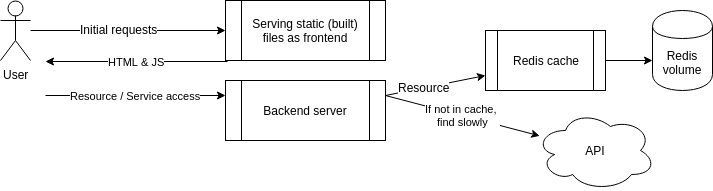
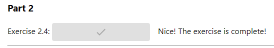

# DevOps with Docker
## Part 2 | Exercise 2.4

In this exercise you should expand the configuration done in [Exercise 2.3](https://devopswithdocker.com/part-2/section-1#exercises-22---23) and set up the example backend to use the key-value database [Redis](https://redis.com/).  
Redis is quite often used as a [cache](https://en.wikipedia.org/wiki/Cache_(computing)) to store data so that future requests for data can be served faster.

The backend uses a slow API to fetch some information. You can test the slow API by requesting `/ping?redis=true` with curl. The frontend app has a button to test this. So you should improve the performance of the app and configure a Redis container to cache information for the backend. The [documentation](https://hub.docker.com/_/redis/) of the Redis image might contain some useful info.

The backend [README](https://github.com/docker-hy/material-applications/tree/main/example-backend) should have all the information that is needed for configuring the backend.  
When you've correctly configured the button will turn green.

Submit the docker-compose.yml



> [!TIP]
> The [restart: unless-stopped](https://docs.docker.com/compose/compose-file/05-services/#restart) configuration can help if the Redis takes a while to get ready.

---

```shell
[root@arch-01 ~]# docker compose up -d
[+] Running 9/9
 ✔ redis Pulled                                                                                                                                                                       4.4s 
   ✔ 4abcf2066143 Pull complete                                                                                                                                                       0.9s 
   ✔ 5c3180d10209 Pull complete                                                                                                                                                       0.9s 
   ✔ f76326fd8e6b Pull complete                                                                                                                                                       1.4s 
   ✔ 034c076ba1e7 Pull complete                                                                                                                                                       1.6s 
   ✔ dffcad17539b Pull complete                                                                                                                                                       2.5s 
   ✔ 5913474e0f39 Pull complete                                                                                                                                                       2.5s 
   ✔ 4f4fb700ef54 Pull complete                                                                                                                                                       2.5s 
   ✔ cc6fccbbefa3 Pull complete                                                                                                                                                       2.6s 
[+] Running 4/4
 ✔ Network root_default  Created                                                                                                                                                      0.1s 
 ✔ Container backend     Started                                                                                                                                                      0.8s 
 ✔ Container frontend    Started                                                                                                                                                      1.1s 
 ✔ Container redis       Started                                                                                                                                                      1.5s 
[root@arch-01 ~]# docker compose ps
NAME       IMAGE          COMMAND                  SERVICE    CREATED              STATUS              PORTS
backend    backend        "/bin/sh -c ./server"    backend    About a minute ago   Up About a minute   0.0.0.0:8080->8080/tcp, :::8080->8080/tcp
frontend   frontend       "docker-entrypoint.s…"   frontend   About a minute ago   Up About a minute   0.0.0.0:5000->5000/tcp, :::5000->5000/tcp
redis      redis:alpine   "docker-entrypoint.s…"   redis      About a minute ago   Up About a minute   6379/tcp
[root@arch-01 ~]# docker compose logs backend
backend  | [Ex 2.4+] Initializing redis client
backend  | [Ex 2.4+] Connection to redis failed! Retrying...
backend  | [Ex 2.4+] Connection to redis initialized, ready to ping pong.
backend  | [Ex 2.6+] POSTGRES_HOST env was not passed so postgres connection is not initialized
backend  | [GIN-debug] [WARNING] Creating an Engine instance with the Logger and Recovery middleware already attached.
backend  | 
backend  | [GIN-debug] [WARNING] Running in "debug" mode. Switch to "release" mode in production.
backend  |  - using env:        export GIN_MODE=release
backend  |  - using code:       gin.SetMode(gin.ReleaseMode)
backend  | 
backend  | [GIN-debug] GET    /ping                     --> server/router.pingpong (4 handlers)
backend  | [GIN-debug] GET    /messages                 --> server/controller.GetMessages (4 handlers)
backend  | [GIN-debug] POST   /messages                 --> server/controller.CreateMessage (4 handlers)
backend  | [GIN-debug] Listening and serving HTTP on :8080
```


