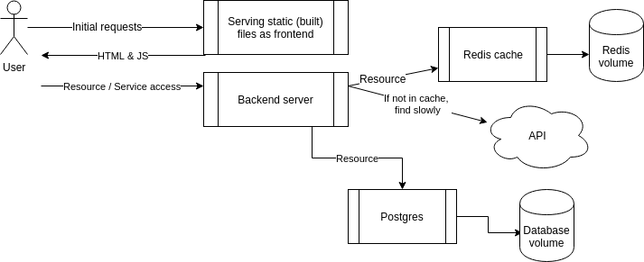

# DevOps with Docker
## Part 2 | Exercise 2.6

Let us continue with the example app that we worked with in [Exercise 2.4](https://devopswithdocker.com/part-2/section-2#exercise-24).  
Now you should add a database to the example backend.

Use a Postgres database to save messages. For now, there is no need to configure a volume since the official Postgres image sets a default volume for us. Use the Postgres image documentation to your advantage when configuring: https://hub.docker.com/_/postgres/. Especially part _Environment Variables_ is a valuable one.

The backend [README](https://github.com/docker-hy/material-applications/tree/main/example-backend) should have all the information needed to connect.  
There is again a button (and a form!) in the frontend that you can use to ensure your configuration is done right.

Submit the docker-compose.yml



---

Environment variables for Redis and Postgres are now moved to a separate file `db.env` and passed directly to containers via the [env_file](https://docs.docker.com/compose/environment-variables/set-environment-variables/#use-the-env_file-attribute) attribute. All relevant files can be found in the exercise subdirectory.

```shell
[root@arch-01 ~]# docker compose up -d
[+] Running 5/5
 ✔ Network root_default  Created                                                                                                                                                                                         0.1s 
 ✔ Container postgres    Started                                                                                                                                                                                         1.3s 
 ✔ Container redis       Started                                                                                                                                                                                         1.3s 
 ✔ Container backend     Started                                                                                                                                                                                         1.7s 
 ✔ Container frontend    Started                                                                                                                                                                                         2.4s 
[root@arch-01 ~]# docker compose ps
NAME       IMAGE             COMMAND                  SERVICE    CREATED         STATUS         PORTS
backend    backend           "/bin/sh -c ./server"    backend    7 seconds ago   Up 4 seconds   0.0.0.0:8080->8080/tcp, :::8080->8080/tcp
frontend   frontend          "docker-entrypoint.s…"   frontend   7 seconds ago   Up 4 seconds   0.0.0.0:5000->5000/tcp, :::5000->5000/tcp
postgres   postgres:alpine   "docker-entrypoint.s…"   postgres   7 seconds ago   Up 5 seconds   5432/tcp
redis      redis:alpine      "docker-entrypoint.s…"   redis      7 seconds ago   Up 5 seconds   6379/tcp
```


