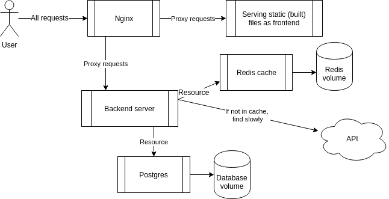
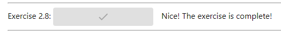

# DevOps with Docker
## Part 2 | Exercise 2.8

In this exercise, you shall add [Nginx](https://hub.docker.com/_/nginx) to work as a [reverse proxy](https://en.wikipedia.org/wiki/Reverse_proxy) in front of the example app frontend and backend.

According to Wikipedia _a reverse proxy is a type of proxy server that retrieves resources on behalf of a client from one or more servers. These resources are then returned to the client, appearing as if they originated from the reverse proxy server itself_.



So in our case, the reverse proxy will be the single point of entry to our application, and the final goal will be to set both the React frontend and the Express backend behind the reverse proxy.

The idea is that a browser makes _all_ requests to http://localhost. If the request has a URL prefix http://localhost/api, Nginx should forward the request to the backend container. All the other requests are directed to the frontend container.

So, at the end, you should see that the frontend is accessible simply by going to http://localhost. All buttons, except the one labeled _Exercise 2.8_ may have stopped working, do not worry about them, we shall fix that later.

The following file should be set to `/etc/nginx/nginx.conf` inside the Nginx container:  
[./nginx.conf](./nginx.conf)

Nginx, backend and frontend should be connected in the same network. See the image above for how the services are connected. You find [Nginx-documentation](https://www.nginx.com/resources/wiki/start/topics/examples/full/) helpful, but remember, the configuration you need is pretty straightforward, if you end up doing complex things, you are most likely doing something wrong.

Submit the docker-compose.yml

---

Given that backend service is supposed to be accessible only via reverse proxy rather than directly (as per exercise requirements), frontend app should be updated accordingly in order for Nginx to then route all API requests to the backend container:  
`ARG REACT_APP_BACKEND_URL=http://localhost/api`

```shell
[root@arch-01 ~]# docker compose up -d
[+] Running 6/6
 ✔ Network root_default     Created                                                                                                                                                   0.1s 
 ✔ Container cache          Started                                                                                                                                                   0.9s 
 ✔ Container database       Started                                                                                                                                                   0.9s 
 ✔ Container backend        Started                                                                                                                                                   1.3s 
 ✔ Container frontend       Started                                                                                                                                                   1.8s 
 ✔ Container reverse-proxy  Started                                                                                                                                                   2.5s 
[root@arch-01 ~]# docker compose ps
NAME            IMAGE             COMMAND                  SERVICE         CREATED         STATUS         PORTS
backend         backend           "/bin/sh -c ./server"    backend         8 seconds ago   Up 7 seconds   0.0.0.0:8080->8080/tcp, :::8080->8080/tcp
cache           redis:alpine      "docker-entrypoint.s…"   cache           8 seconds ago   Up 7 seconds   6379/tcp
database        postgres:alpine   "docker-entrypoint.s…"   database        8 seconds ago   Up 7 seconds   5432/tcp
frontend        frontend          "docker-entrypoint.s…"   frontend        8 seconds ago   Up 6 seconds   0.0.0.0:5000->5000/tcp, :::5000->5000/tcp
reverse-proxy   nginx:alpine      "/docker-entrypoint.…"   reverse-proxy   8 seconds ago   Up 5 seconds   0.0.0.0:80->80/tcp, :::80->80/tcp
```



```shell
backend  | [GIN] 2024/05/16 - 21:39:58 | 200 |      46.489µs |    10.244.11.53 | GET      "/ping"
```
