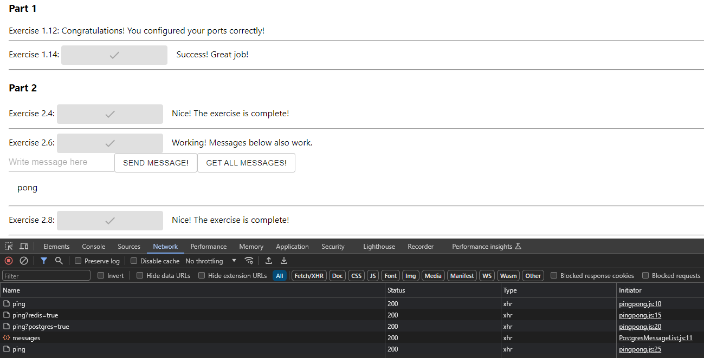

# DevOps with Docker
## Part 2 | Exercise 2.9

Most of the buttons may have stopped working in the example application. Make sure that every button for exercises works.

Remember to take a peek into the browser's developer consoles again like we did back [part 1](https://devopswithdocker.com/part-1/section-6), remember also [this](https://github.com/docker-hy/material-applications/tree/main/example-frontend#exercise-114---to-connect-to-backend) and [this](https://github.com/docker-hy/material-applications/tree/main/example-backend).  
The buttons of the Nginx exercise and the first button behave differently but you want them to match.

If you had to make any changes explain what you did and where.  
Submit the docker-compose.yml and both Dockerfiles.

---

Migrated all services to a custom (user-defined) bridge network:

> User-defined bridge networks are superior to the default bridge network.
>
> - User-defined bridges provide automatic DNS resolution between containers.
> - User-defined bridges provide better isolation.
> - Containers can be attached and detached from user-defined networks on the fly.
> - Each user-defined network creates a configurable bridge.
>
> Source:  
> https://docs.docker.com/network/drivers/bridge/

Dockerfile: [frontend](frontend/Dockerfile)  
Dockerfile: [backend](backend/Dockerfile)  
Compose: [docker-compose.yml](./docker-compose.yml)  

```shell
[root@arch-01 ~]# docker compose up -d
[+] Running 6/6
 ✔ Network fullstack        Created                                                                                                                                         0.1s 
 ✔ Container database       Started                                                                                                                                         1.1s 
 ✔ Container cache          Started                                                                                                                                         1.0s 
 ✔ Container backend        Started                                                                                                                                         1.5s 
 ✔ Container frontend       Started                                                                                                                                         2.1s 
 ✔ Container reverse-proxy  Started                                                                                                                                         2.9s 
[root@arch-01 ~]# docker compose ps
NAME            IMAGE             COMMAND                  SERVICE         CREATED         STATUS         PORTS
backend         backend           "/bin/sh -c ./server"    backend         6 seconds ago   Up 4 seconds   0.0.0.0:8080->8080/tcp, :::8080->8080/tcp
cache           redis:alpine      "docker-entrypoint.s…"   cache           6 seconds ago   Up 5 seconds   6379/tcp
database        postgres:alpine   "docker-entrypoint.s…"   database        6 seconds ago   Up 4 seconds   5432/tcp
frontend        frontend          "docker-entrypoint.s…"   frontend        5 seconds ago   Up 3 seconds   0.0.0.0:5000->5000/tcp, :::5000->5000/tcp
reverse-proxy   nginx:alpine      "/docker-entrypoint.…"   reverse-proxy   5 seconds ago   Up 3 seconds   0.0.0.0:80->80/tcp, :::80->80/tcp
```



```shell
reverse-proxy  | 10.244.13.232 - - [18/May/2024:00:14:37 +0000] "GET /api/ping HTTP/1.1" 200 4
reverse-proxy  | 10.244.13.232 - - [18/May/2024:00:14:38 +0000] "GET /api/ping?redis=true HTTP/1.1" 200 4
reverse-proxy  | 10.244.13.232 - - [18/May/2024:00:14:40 +0000] "GET /api/ping?postgres=true HTTP/1.1" 200 4
reverse-proxy  | 10.244.13.232 - - [18/May/2024:00:14:42 +0000] "GET /api/messages HTTP/1.1" 200 37
reverse-proxy  | 10.244.13.232 - - [18/May/2024:00:14:43 +0000] "GET /api/ping HTTP/1.1" 200 4
```
