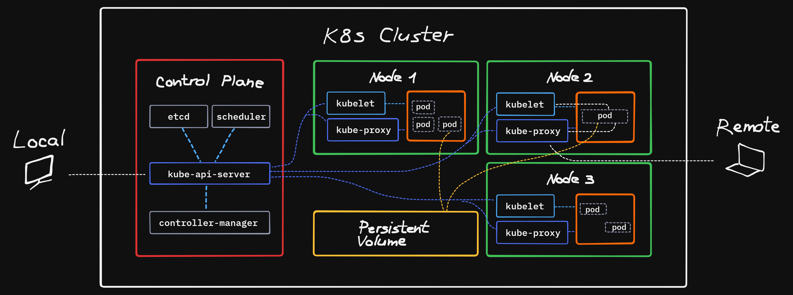

# DevOps with Docker
## Part 3 | Exercise 3.11

Familiarize yourself with Kubernetes terminology and draw a diagram describing what "parts" the Kubernetes contain and how those are related to each other.

You should draw a diagram of at least **3** host machines in a Kubernetes cluster. In the diagram assume that the cluster is running **2** applications. The applications can be anything you want. An example could be a video game server and a blog website.

You may take inspiration from the diagrams of [part 2](https://devopswithdocker.com/part-2).

The applications may utilize other machines or APIs that are not part of the cluster. At least **3** of the machines should be utilized. Include "your own computer" in the diagram as the one sending instructions via kubectl to deploy an application. In addition, include a HTTP message coming from the internet to your Kubernetes cluster and how it may reach an application.

- [glossary](https://kubernetes.io/docs/reference/glossary/?fundamental=true)
- [helpful diagrams](https://medium.rip/@tsuyoshiushio/kubernetes-in-three-diagrams-6aba8432541c)
- [drawing tool](https://www.tldraw.com/)

---

