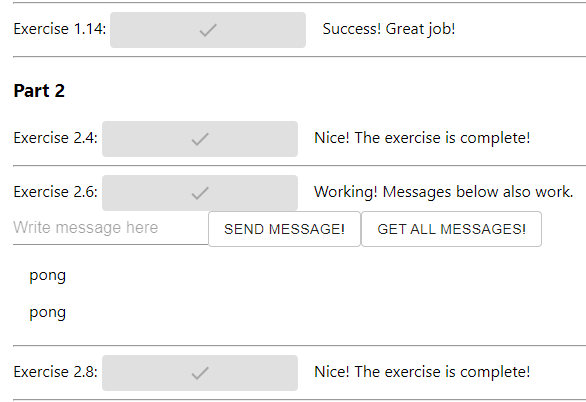

# DevOps with Docker
## Part 3 | Exercise 3.7

As you may have guessed, you shall now return to the frontend and backend from the previous exercise.

Change the base image in FROM to something more suitable. To avoid the extra hassle, it is a good idea to use a pre-installed image for both [Node.js](https://hub.docker.com/_/node) and [Golang](https://hub.docker.com/_/golang). Both should have at least Alpine variants ready in Docker Hub.

Note that the frontend requires Node.js version 16 to work, so you must search for a bit older image.

Make sure the application still works after the changes.  
Document the size before and after your changes.

---

| Docker image size | Exercise 3.5 | Exercise 3.6 | Exercise 3.7 |
| ----------------- | ------------ | ------------ | ------------ |
| backend | 664 MB | 446 MB | 316 MB |
| frontend | 667 MB | 480 MB | 305 MB |

```shell
[root@arch-01 ~]# docker compose up -d
[+] Running 6/6
 ✔ Network fullstack        Created                                                                                                                                                   0.1s 
 ✔ Container database       Started                                                                                                                                                   1.0s 
 ✔ Container cache          Started                                                                                                                                                   1.0s 
 ✔ Container backend        Started                                                                                                                                                   1.3s 
 ✔ Container frontend       Started                                                                                                                                                   1.7s 
 ✔ Container reverse-proxy  Started                                                                                                                                                   2.2s 
[root@arch-01 ~]# docker compose ps
NAME            IMAGE             COMMAND                  SERVICE         CREATED          STATUS          PORTS
backend         backend           "/bin/sh -c ./server"    backend         18 seconds ago   Up 16 seconds   8080/tcp
cache           redis:alpine      "docker-entrypoint.s…"   cache           18 seconds ago   Up 16 seconds   6379/tcp
database        postgres:alpine   "docker-entrypoint.s…"   database        18 seconds ago   Up 16 seconds   5432/tcp
frontend        frontend          "docker-entrypoint.s…"   frontend        18 seconds ago   Up 15 seconds   5000/tcp
reverse-proxy   nginx:alpine      "/docker-entrypoint.…"   reverse-proxy   18 seconds ago   Up 15 seconds   0.0.0.0:80->80/tcp, :::80->80/tcp
```


